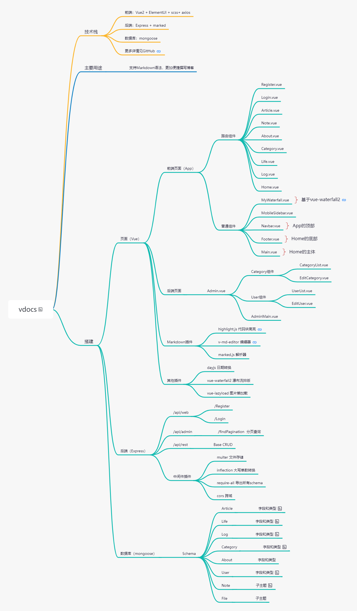

# 博客系统开发感想
> &emsp;&emsp;最近事情还是挺多的，每天也感觉很不错。就是这个开发博客系统的问题，我突然就发现我自身很多的问题，项目也遇见了瓶颈，有些问题都不知道该
> 怎么下手解决，解决了又该怎么提升性能，提升性能的同时该如何使代码更优美，程序逻辑更清晰...很多问题😟。
## 原因
&emsp;&emsp;首先，说说想要开发自己的博客系统的原因。虽然这个`docsify`搭建的静态博客还不错，但是真真真真的是太麻烦的，我每次要写一篇文章都得找几个
文件添加上对应的组件或者路由，属实给我搞烦了（我太懒了）。没错，懒就是程序猿的第一驱动力，于是就说开始就开始。

## 开发过程
&emsp;&emsp;一开始，没什么计划，直接就看了一点别人开发博客系统的大概使用的技术，再加上我之前有开发移动端的王者荣耀官网
的一丢丢经验（实际忘光了），我就自信的开始了项目搭建。
### 关于写登录页面
&emsp;&emsp;框架还是老套路，`Vue`+`ElementUi`，当时也不知道写个怎样的登录页面好，就直接把以前的写过的一个copy了过来，想着先把后端的登录流程完善，
再转头想想该如何设计。经过一番的努力，将前后端打通了，还是挺顺利的。后端就是`Nodejs`+`mongoose`，算是小有成就感（现在想想真搞笑）。
### 其他实现
&emsp;&emsp;写着写着就不对劲了，我突然意识到这不是一个像记事本的小项目，上手就做，你能不能清醒点，你是第一次开发这种前后端而且功能还不少的项目。后面
还是完善了很多功能，比如：对文章的增删改查，对用户的增删改查，对分类的增删改查。没错，只有增删改查...期间我划分了许多模块，但是写起来还是觉得让人头疼，
文件实在是太多了，出了问题到处找，找到了还得将这条线的程序运行思路串起来，再加上代码还是有点多的，看的我是眼花缭乱。我想要将`Markdown`集成在我的项目
中，找到了`marked.js`库，用来解析；找到了`highlight.js`库，用来高亮代码块。但我还是对于每个文章生成侧边栏和文章的排版没有思路。种种原因使开发者
不堪负重，选择暂停开发。

## 收获
&emsp;&emsp;虽然过程很坎坷，但是基本的功能、效果都实现了，还是有不小收获，等闲下来的时候再划分好模块，我对于自己的代码和项目要求还是很高的，起码做到
我目前认为很合适的效果。反思了以下几点，并有了更合适地解决方案。
- 关于`axios`的封装问题
- 关于后端三层架构的划分
- 关于前端视图层与数据层的解耦
- 关于项目lifecycle的实现
- 关于可扩展性和可维护性的问题
